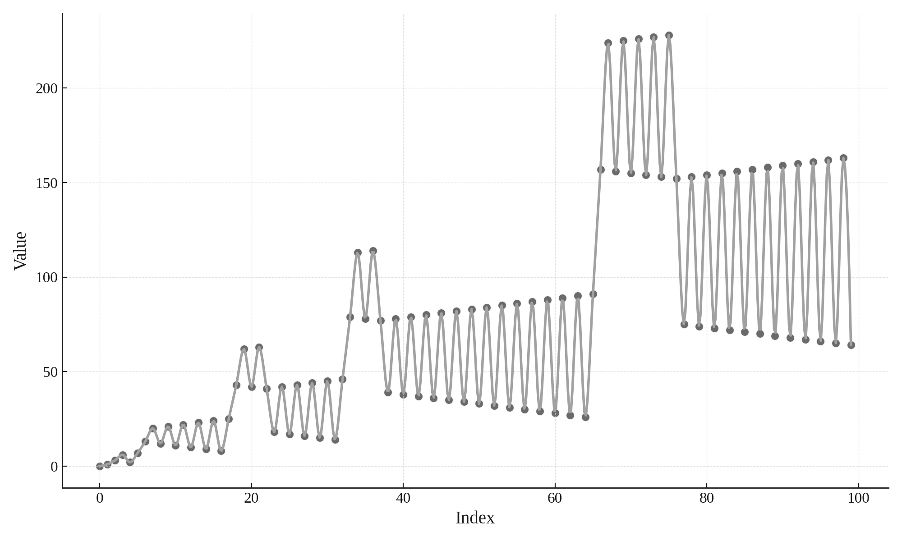

<section class="slide">

# Exercise: Recamán's Sequence

</section>

<section class="slide">



</section>

<section class="slide">

The Recamán Sequence is interesting because while it trends upwards over time,
it also has large jumps down.

</section>

<section class="slide">

\\[
n_i = \begin{cases}
0 & \text{if}\ i = 0 \\\\
n_{i-1} - i & \text{if}\ n_{i-1} - n\ \text{is positive and is not already in the sequence} \\\\
n_{i-1} + i & \text{otherwise} \\\\
\end{cases}
\\]

</section>

<section class="slide">

| \\( i \\) | \\( n \\) | n seen          |
|-----------|-----------|-----------------|
|   0       | 0         | 0               |
|   1       | 1         | 0, 1            |
|   2       | 3         | 0, 1, _, 3         |
|   3       | 6         | 0, 1, _, 3, _, _, 6      |
|   4       | 2         | 0, 1, 2, 3, _, _, 6   |
|   5       | 7         | 0, 1, 2, 3, _, _, 6, 7   |
|   6       | 13         | 0, 1, 2, 3, _, _, 6, 7, _, _, _, _, 13   |

</section>

<section class="slide">

```rust,editable
{{ #include exercises/recaman/src/main.rs }}
```

[[playground link]](https://play.rust-lang.org/?version=stable&mode=debug&edition=2021&gist=37c5ed2da968d6921cbd1dd2be06e82c)

</section>

<section class="slide">

## Task 1

Generate and print the first 15 members of the sequence

# Task 2

Find the first duplicated number in the sequence.

# Task 3

Find how many terms of the sequence are needed until all the integers from 0 to 100, inclusive, are generated.


</section>
<section class="slide">

## Acknowledgement

 - https://rosettacode.org/wiki/Recaman%27s_sequence
</section>
